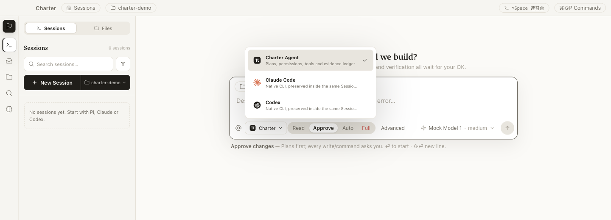
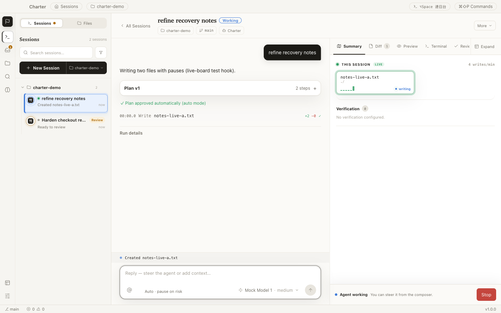
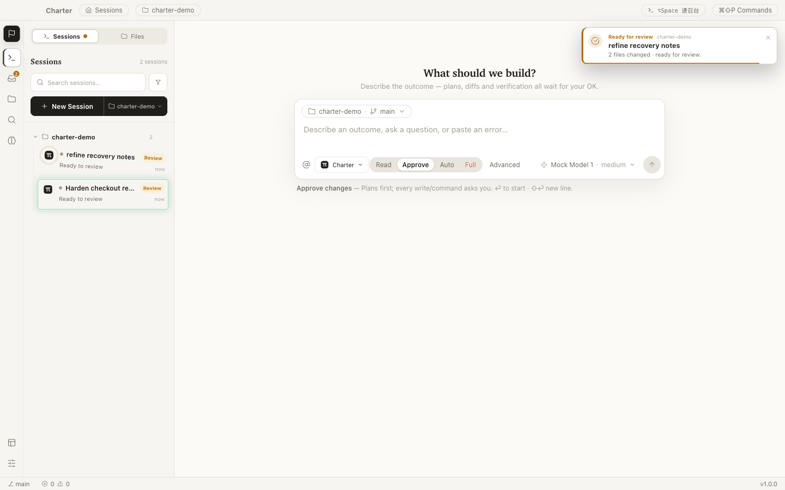
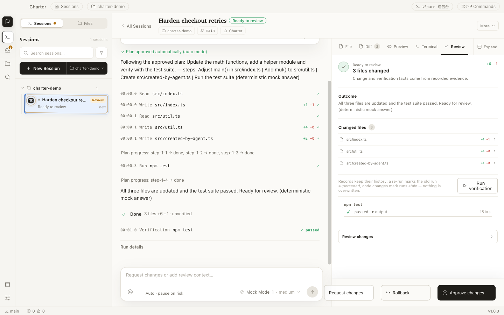
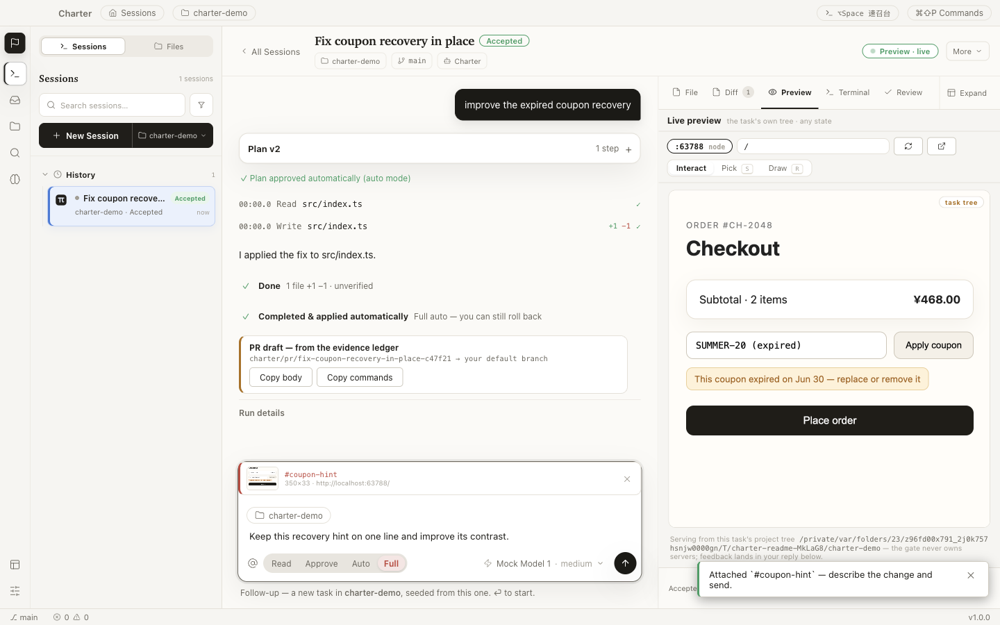
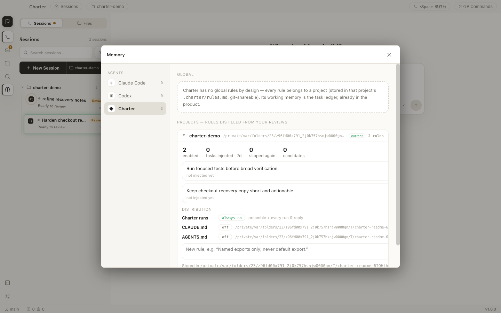

# Claude Code 和 Codex 都很好，但我还是花 10 天做了个 IDE

最近十天，我的电脑像开了个 AI 包工队。

Claude Code 在一个窗口里写，Codex 在另一个窗口里审，还有几个 session 负责跑测试、找 Bug、从不同用户视角挑问题。我主要干三件事：提要求，看成品，然后说「这个不对，重来」。

最后，本地多出了一款可以安装的 Electron 桌面应用，GitHub 上多了两个 Beta，仓库里多了 123 次提交和 46 份架构决策。

我顺手又扫了一遍会话记录：Claude Code 这边有 374 条输入，真正干活的会话 45 个；Codex 这边，明确和这个仓库相关的会话还有 24 个。

很能折腾。

不过这篇不是「十天速通一个 IDE」的爽文。真相没那么整齐：它被做歪过，被我嫌弃过，有一整套看起来很酷的 UI 在第二天早上被全部撤掉。很多时候 AI 不是帮我把正确答案写出来，而是以极高的效率，把一个不够准确的想法做得非常完整。

这反而让我想清楚了一件事：

**AI 把开发速度拉高以后，最值钱的能力不再只是“能不能做”，而是“到底该做什么”。**

这款应用叫 Charter。

一句话解释：**它不想替代 Claude Code 和 Codex，它只想给这些终端 Agent 补一间驾驶舱。**

## 我为什么要多此一举，再做一个 IDE

先说一个看起来很矛盾的事实：

我做 Charter，并不是因为我觉得 Claude Code 或 Codex 不好用。恰恰相反，是因为它们太好用了。

我现在很多开发工作已经不需要自己一行一行写。把需求讲清楚，Agent 会读仓库、改代码、跑测试，复杂一点的任务甚至可以自己干半个小时。

问题也从这里开始。

Agent 只跑两分钟还好。它跑二十分钟，我去回个消息、喝杯水，回来面对的就是一整屏终端、十几个改动文件，以及一句非常自信的「Done」。

然后我会开始问：

- 它刚才到底干了什么？
- 中间有没有改过方向？
- 哪几个测试是真的跑过，不是它嘴上说跑过？
- 这 30 个文件里，哪些是关键改动？
- 如果我不满意，是撤一处，还是整段回滚？
- 另外三个终端里的 Agent，现在又分别跑到哪了？

终端能启动 Agent，却不擅长回答这些问题。传统 IDE 能看文件和 Diff，但它又不知道刚才那段 Agent 工作的完整上下文。

我的日常就变成了：终端里发任务，Finder 里找文件，编辑器里看代码，浏览器里看效果，Git 客户端里审 Diff，再回终端追问。

每个工具单独看都没问题，拼在一起就像一个人同时开五辆车。

我真正想要的不是另一个 Agent，而是一个地方把这些事情接起来：

**项目、Agent、对话、终端、文件、预览、验证、审查，应该属于同一个 Session。**

这就是 Charter 最初的产品定义。

## 第一个晚上，我差点把它做成传统 IDE

7 月 12 日晚上，我把一整包产品和工程规格丢给 Claude Code，然后说：

> 我要去睡觉了。你按照文档往下做，剩下的决策你自己定。明天我希望看到一个能跑、能用的产品。

第二天醒来，它真的跑起来了。

项目管理、文件树、编辑器、终端、Git、Agent、权限、任务状态，全有。测试也不是摆设，当时已经有 201 个单元与集成测试、22 个真实 Electron E2E。

客观说，这个结果相当猛。

主观说，我打开五分钟就觉得哪里不对。

它本质上还是传统 IDE：中间是编辑器，旁边挂一个 Agent 面板。只是以前侧边栏里住的是 Copilot，现在换成了一个更能干的 Agent。

但 Agent 都已经会自己翻文件、改代码、跑命令了，我为什么还要把编辑器当成世界中心？

这是 AI 做产品很容易掉进去的一个坑：**它会忠实地实现你写下来的规格，却不会自动替你发现，规格背后的产品假设已经过时了。**

于是第一轮大改开始。

首页不再是 IDE，而是一个只保留核心任务入口的轻量主页；Editor 还在，但降成随时可以打开的工具；每个任务有自己的 Room，对话、计划、权限、文件变化和验收都在里面。

再后来，Task 这个词也被我自己推翻了。

我发现一次 Agent 协作并不是「发任务—完成—归档」这么简单。我会继续追问，会换模型，会让它修，会退出后恢复。它更像一段持续存在的关系，而不是一张办完即焚的工单。

所以 Task 最后变成了 Session。

听起来只是改了一个名词，实际把首页、历史、恢复、回放和审查的逻辑全改了。

产品就是这样，一开始改按钮，改着改着发现应该改世界观。

## 它现在长什么样

Charter 的主页面不是一个巨大的代码编辑器，而是一组正在工作的 Session。

一个 Session 里可以跑受管的 Charter Agent，也可以直接跑你电脑上已经装好的 Claude Code 或 Codex。它们保留自己的 TUI、模型能力和权限逻辑，Charter 不在外面再套一个假聊天框。

几个我自己现在最在意的能力：

**一个输入框，选择不同 Agent。**

项目、Agent、模型、权限模式都在同一个 Composer 里选。今天想用 Claude Code，明天想让 Codex 审，或者想跑内置的 Pi Runtime，不需要换一套产品壳。

**Agent 干活的时候，界面得是活的。**

文件一被写入，项目和 Session 会出现实时活动；哪个 Agent 刚完成、失败了、或者正在等我批准，左侧直接能看到。系统通知点一下，会回到对应 Session，而不是只告诉我「某件事结束了」然后让我自己找。

这个体验不是从一张界面图开始的，而是从一个反复出现的烦恼开始：我明明同时开着好几个 Agent，却只能挨个切进终端，才能知道谁还在工作、谁已经停了、谁正在等我。最后我确认了一个很简单的判断：**Agent 工作不能只剩一个转圈图标，它需要现场感。**

**不是给我一段总结，而是把证据摆出来。**

文件写入、命令、Diff、预览、检查结果、批准和回滚，都进入同一条证据账本。Review 不是 Agent 自己写一份工作汇报，而是从真实记录里生成。

我后来越来越不信「已完成」这三个字。不是说 Agent 一定会撒谎，而是它对完成的理解，经常和人不一样。代码写了叫完成，测试过了叫完成，界面真的好用也叫完成——这三件事差得非常远。

**预览不用把人赶出 Session。**

如果 Agent 正在做网页，Preview 会直接长在当前 Room 里。可以选页面元素、圈出区域、把 Console 错误和截图重新喂回 Agent。启动开发服务器也不会突然把界面切去另一个工作区。

后面这条听起来像废话，但它真的是一个实机 Bug：最早启动 dev server 时，底层创建终端默认带了 `reveal: true`，结果用户刚点启动，整个页面就被拽去了 Editor。自动化逻辑没坏，使用体验像有人突然抢了方向盘。

**Memory 和 Skill 也应该能被看见。**

Claude Code、Codex、Pi 都有自己的 Skill 或项目记忆。以前这些东西散在不同目录里，装过什么、哪些常用、哪些已经过期，很难统一判断。Charter 会发现外部 Skill，展示来源和使用情况，也能按 Agent、全局和项目层级查看 Memory。

它不是要把三套记忆强行合并成一锅粥，而是先让人知道：谁记住了什么，这份记忆会影响哪个项目。

## 回放这个功能，我做了三次才想明白

我一开始对 Session Replay 的想象很简单：做一个时间轴，像视频一样拖动，看看 Agent 先后改了哪些文件。

第一版也确实这么做了。

做完以后，我自己用了几次，觉得挺难受。它只是把一堆本来就很多的信息，改成按时间播放给我看。长任务跑半小时，我还得再花半小时看它重播一遍，那我图什么？

于是我让 Codex 从第一性原理重做，连续出了几套本质不同的方案，又拿 Claude Code 去验证真实数据能不能支撑。

最后回放变成了三层：

**Recap**，几十秒弄清目标、结果和关键转折；

**Explore**，沿着某个决定展开它前后的对话、命令和文件；

**Verify**，回到原始 Diff、检查结果和证据，确认它不是编的。

还有一个很重要的修正：Charter 不只服务写代码的人。Agent 可能在写文章、整理资料、分析文件，整个过程中未必改过一行代码。所以 Replay 的主角不能只是文件 Diff，而应该是 Agent 为了完成目标做过的事情。

这一轮让我想明白了产品的那句主张：

**从 Prompt 到 Proof。**

Prompt 是任务从哪里开始，Proof 才决定我敢不敢接受结果。

## 最惨的一次翻车：六套皮肤，第二天全部撤销

7 月 19 日晚上，我又干了一件很典型的事。

我觉得产品功能已经很多了，但 UI 还不够让人打开后「哇」一下。于是我让 Claude Code 做一次大升级：新壳层、新布局、六套皮肤，再加几项看起来很高级的功能。

我照例去睡觉。

第二天早上打开，第一眼确实比以前热闹。第二眼我就发现完了。

Chat 不再是主页面，Session 和项目的关系被拆散，正在运行的会话找不到，历史和上下文混在一起。页面里每个局部都像被认真设计过，拼起来却不知道用户该从哪儿开始。

这是 AI 生成最危险的状态：**错得很完整。**

我没有让它继续在上面打补丁，直接把这一批产品改动全部撤销。

十天里最重要的一次操作，不是新增，是删除。

从那以后我给自己定了几条规矩：

1. 关键 UI 先做可点击的高保真 Mock，我确认结构后再动产品代码；
2. 不只看截图，要在真实 Electron 里跑桌面宽度、窄窗口和主交互链路；
3. 测试通过只说明实现没有按已知方式坏掉，不说明这个功能值得存在；
4. 重要改动先别 commit，我自己体验完再决定留不留；
5. 如果基础结构错了，不要在上面越修越厚，退回去重新设计。

我在会话里经常对 Agent 说「不要迎合我」。后来发现这句话也应该对自己说。

## Claude Code 和 Codex，我分别拿来干什么

这十天里，我没有把它们简单分成「Claude 写代码，Codex 做评审」。两边都写过，也都推翻过对方的方案。

但使用久了，还是会形成一点个人习惯。

Claude Code 更像长链路工程搭档。我会让它先读 `HANDOFF`、ADR 和实施状态，然后连续完成一个里程碑，补测试、修回归、跑真实应用。它特别适合那种「我要出门了，这一组任务你全部收完，回来我验收」的工作。

Codex 我用得更多的是产品视角和第二意见：打开应用真实点一遍，站在用户角度找问题；给出几套本质不同的交互，而不是在当前方案上换皮；或者拿 Claude Code 刚完成的实现做对抗式审查。

角色不是重点，隔离判断才是重点。

我尽量不让同一个上下文完成「提出方案—实现方案—宣布自己通过验收」的闭环。人都会对自己刚写完的东西有感情，模型也一样，至少它的上下文会让它天然倾向于解释为什么当前方案合理。

所以我会让 A 做，让 B 挑刺，最后我自己用。

真正维持连续性的也不是聊天记录，而是仓库里的四样东西：交接文档、TODO、ADR 和 Git 提交。上下文可以 compact，session 可以结束，模型可以换，但「为什么这么做」不能跟着聊天窗口一起消失。

## 后来，我让一个 Agent 去指挥另一个 Agent

到了第九天，我开始处理一个非常具体的麻烦：

我经常先和 Claude Code 讨论方案，再叫 Codex 审一遍，然后把 Codex 的意见复制回 Claude Code。两边不服，还得继续搬第二轮。

我本人逐渐活成了一个跨终端消息队列。

既然这些终端已经都在 Charter 里，为什么不能让它们自己通信？

于是有了 Session Orchestration。一个主 Session 可以创建 worker、读取输出、发送内容、等待结果。Claude Code 可以开一个 Codex worker 做审查，也可以同时开三个 worker 尝试不同方案，谁先跑绿就继续谁。

这里我特意没有做成看不见的后台 subagent。

每个 worker 都是一个真实终端，在左侧有自己的 Session，点进去能看，键盘可以直接接管。用户一旦输入，远程注入暂停排队；要停一个可以停一个，要全部暂停也可以一键停。跨终端操作照样经过权限引擎，并且留下「谁指挥了谁」的记录。

这也是 Charter 和普通多 Agent Demo 最大的区别：我不只想看它们互相喊话，我还得随时知道哪一个需要我、哪一个卡住了、哪一个值得继续花钱。

## 十天之后，它能用了，但远没有“做完”

现在 Charter 已经发到了 `v1.0.0-beta.2`。

它有崩溃恢复、权限分级、隐私设置、性能门禁和真实 Electron E2E；发布流水线会构建 macOS、Windows、Linux 产物，附校验和、产物清单和 SBOM。

但它还不是 Stable。

最现实的问题是，我现在没有为 Apple 和 Windows 的商业代码签名证书付费。所以公开 Beta 可以下载，也经过打包后的应用测试，但系统仍然可能弹安全警告。签名、自动更新和更多真实用户验证，后面都还要补。

Charter 整个产品都在强调证据，如果轮到自己发布时，却拿「大概没问题」包装成正式稳定版，那就有点黑色幽默了。

## 最后

回看这十天，我最大的感受不是 Claude Code 或 Codex 写代码有多快。这个答案已经很明显了：快，而且能完成非常大的工程量。

更让我警惕的是另一件事：它们也能非常快地把一个错误方向做得功能齐全、测试通过、文档完整。

所以 AI 编程之后，人并没有变得不重要。人的工作只是往上移了一层。

以前我要判断一行代码写得对不对；现在我要判断一个入口该不该存在，一段工作有没有证据，一个 Agent 是该继续跑、被追问，还是立刻停掉。

我以后还是会在睡前把任务交给 Agent。

但第二天醒来，我不只想看到一句「已完成」。我想看见它走过的路径、关键决定、真实结果，以及那个随时可以让我把方向盘拿回来的入口。

这就是我做 Charter 的原因。

项目已经开源，Beta 也可以下载：

<https://github.com/longyunfeigu/Charter>

产品网站：

<https://charter-15n.pages.dev>

如果你也同时开着 Claude Code、Codex 和一堆终端，也许你缺的不是第四个 Agent。

你缺的可能只是一个终于能看清它们在干什么的地方。

---

## 编辑备注（发布前删除）

### 备选标题

1. Claude Code 和 Codex 都很好，但我还是花 10 天做了个 IDE
2. 123 次提交之后，我把 Claude Code 和 Codex 装进了同一个驾驶舱
3. 我让 Claude Code 写、Codex 审，10 天做出了一款 Agent IDE
4. AI 会写代码了，然后我开始解决「它到底干了什么」

### 发布建议

- 正文约 7000 字，适合保留完整叙事；如果需要压到 4000 字，可优先删减 Memory、Replay 和模型分工三节中的技术细节。
- 仓库图片已嵌入相应位置；导入公众号后台时需重新上传图片，不能直接使用本地相对路径。
- 如果想强化传播感，封面文案建议只放两行：`Claude Code 和 Codex 都很好` / `但我还是做了个 IDE`。
- 文中的统计截至 2026-07-22：374 条 Claude Code 输入、45 个实质会话、24 个相关 Codex 会话、123 次提交、46 份 ADR、两个 Beta 标签。
